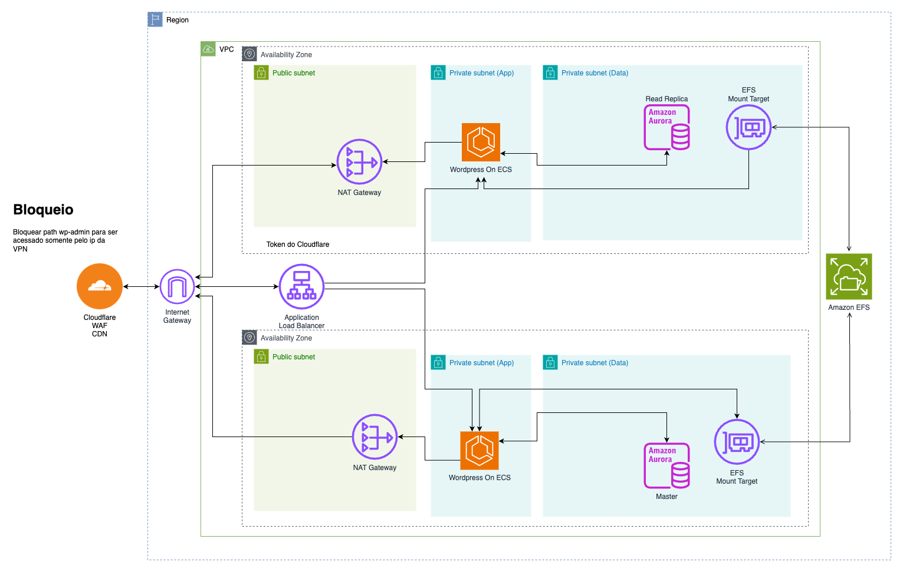

# Visão Geral da Arquitetura

## Objetivo

**O que deve conter:**  
Descreva o propósito geral da aplicação ou sistema. Apresente o contexto institucional ou de negócio que motivou sua criação e os benefícios esperados com sua adoção.

**Exemplo:**

Esta solução tem como objetivo hospedar portais institucionais baseados em WordPress com alta disponibilidade, segurança e governança. A arquitetura foi desenhada para ser reutilizável por múltiplos projetos da organização, com foco em automação, isolamento de ambientes e controle centralizado de acesso.

**Benefícios esperados:**
- Redução no tempo de provisionamento de novos portais.
- Melhoria na segurança e conformidade com normativas.
- Simplificação da manutenção e atualização dos ambientes.

---

## Finalidade do Sistema

**O que deve conter:**  
Descreva qual problema o sistema resolve e quem são seus usuários. Apresente os principais requisitos funcionais e não funcionais que impactaram o desenho da arquitetura.

**Exemplo:**

O sistema atende à necessidade de publicação de conteúdo institucional de forma autônoma pelas equipes de comunicação, com segurança reforçada no painel administrativo e infraestrutura escalável e resiliente.

**Usuários principais:**
- **Administradores de conteúdo:** responsáveis pela criação e edição das páginas.
- **Visitantes públicos:** acessam os conteúdos publicados.

**Requisitos que impactaram a arquitetura:**
- **Funcionais:** múltiplos ambientes (dev, homologação, produção), suporte a temas/plugins customizados, integração com provedor de identidade.
- **Não funcionais:** alta disponibilidade, escalabilidade horizontal, registro de auditoria, backups automáticos e recuperação de desastres.

---

## Componentes Principais

**O que deve conter:**  
Liste os principais serviços e tecnologias utilizados. Para cada componente, descreva sua função, sua relação com os demais e se é gerenciado ou customizado.

**Exemplo:**

### 1. Cloudflare
- **Função:** DNS, proxy reverso, WAF e CDN.
- **Relacionamento:** protege e acelera o tráfego HTTP, aplicando políticas de segurança e cache.
- **Tipo:** serviço gerenciado com automação via token.

### 2. Application Load Balancer (ALB)
- **Função:** balanceador de carga HTTP.
- **Relacionamento:** distribui requisições para containers do WordPress no ECS Fargate.
- **Tipo:** gerenciado pela AWS.

### 3. Amazon ECS (Fargate)
- **Função:** execução de containers sem gerenciamento de servidores.
- **Relacionamento:** executa instâncias isoladas do WordPress.
- **Tipo:** gerenciado com configuração customizada via imagem Docker.

### 4. Amazon Aurora (MySQL)
- **Função:** banco de dados relacional escalável.
- **Relacionamento:** armazena o conteúdo do site com instância primária e réplica de leitura.
- **Tipo:** serviço gerenciado com backup e replicação automáticos.

### 5. Amazon EFS
- **Função:** sistema de arquivos compartilhado entre containers.
- **Relacionamento:** armazena uploads, plugins e temas.
- **Tipo:** gerenciado pela AWS, montado via target em sub-redes privadas.

### 6. VPN + WAF
- **Função:** restringe o acesso ao painel administrativo `/wp-admin`.
- **Relacionamento:** acesso autorizado apenas a usuários da VPN institucional via regras de IP no WAF da Cloudflare.
- **Tipo:** configuração personalizada de segurança.

---

## Integrações Externas

**O que deve conter:**  
Liste e justifique as integrações com provedores externos. Indique o tipo de integração (DNS, autenticação, CI/CD etc.) e sua motivação técnica.

**Exemplo:**

### 1. Cloudflare
- **Tipo:** DNS gerenciado e segurança (WAF/CDN).
- **Motivação:** proteção na borda, controle de tráfego e automação de zonas via API.

### 2. GitLab CI/CD
- **Tipo:** deploy automatizado via pipeline.
- **Motivação:** entrega contínua confiável de imagens Docker para o ECS.

### 3. EntraID (Azure AD)
- **Tipo:** autenticação federada (IdP).
- **Motivação:** controle de acesso centralizado, com autenticação multifator e auditoria.

---

## Diagrama da Arquitetura

**O que deve conter:**  
Inclua um diagrama de containers destacando sub-redes, serviços internos, pontos de entrada e comunicação entre componentes.

**Exemplo:**

**Observações:**
- O tráfego entra via Cloudflare, que aplica políticas de WAF e encaminha ao ALB.
- O ALB distribui as requisições entre containers ECS em sub-redes privadas.
- Os containers WordPress acessam o Aurora e armazenam dados no EFS.
- A área `/wp-admin` é protegida por regras de IP e autenticação federada.

---

## Fluxo de Tráfego

**O que deve conter:**  
Descreva de forma sequencial como o tráfego flui no sistema, do acesso inicial até a resposta final.

**Exemplo:**

1. **Entrada de tráfego:**
   - O usuário acessa o domínio configurado no Cloudflare.
   - O WAF valida o tráfego e aplica regras de cache e proteção.

2. **Roteamento interno:**
   - O ALB recebe a requisição e roteia para uma task ECS.
   - O container WordPress processa a requisição.

3. **Acesso a dados:**
   - Leitura e escrita são feitas no Aurora.
   - A réplica é usada para consultas de leitura intensiva.

4. **Armazenamento persistente:**
   - Arquivos são armazenados em EFS, acessado por múltiplos containers.

5. **Segurança de acesso:**
   - `/wp-admin` só é acessível por IPs autorizados na VPN.
   - Autenticação federada via Azure AD com MFA.

---

## Princípios de Arquitetura Adotados

**O que deve conter:**  
Liste os princípios que orientaram o desenho da solução. Isso deve refletir decisões técnicas alinhadas à estratégia institucional.

**Exemplo:**

- **Isolamento de ambientes:** cada portal é implantado em sua própria stack (infra + app).
- **Infraestrutura como código:** todos os recursos AWS e configurações são provisionados via Terraform.
- **Segurança em camadas:** WAF, autenticação federada, redes privadas e uso de VPN.
- **Escalabilidade horizontal:** containers ECS sobem sob demanda conforme carga.
- **Governança de acesso:** EntraID utilizado como IdP central, com logs de auditoria.

---

## Prompt para Geração Automática

**O que deve conter:**  
Forneça um modelo de prompt para ser utilizado com ferramentas de IA que possam auxiliar na geração automatizada de documentação.

**Exemplo:**

> Você é um arquiteto sênior documentando uma solução em nuvem AWS. Com base na seguinte descrição:  
> 'Sistema WordPress institucional hospedado na AWS, utilizando Cloudflare, ALB, ECS Fargate, Aurora, EFS, WAF e controle de acesso via Azure AD.'  
>
> Escreva as seguintes seções da documentação técnica:  
> - Objetivo do sistema  
> - Finalidade (usuários e requisitos)  
> - Componentes principais (função, relacionamento e tipo)  
> - Integrações externas  
> - Fluxo de tráfego  
> - Princípios de arquitetura adotados  
>
> Use linguagem técnica e padronizada, com exemplos claros e estrutura objetiva.
